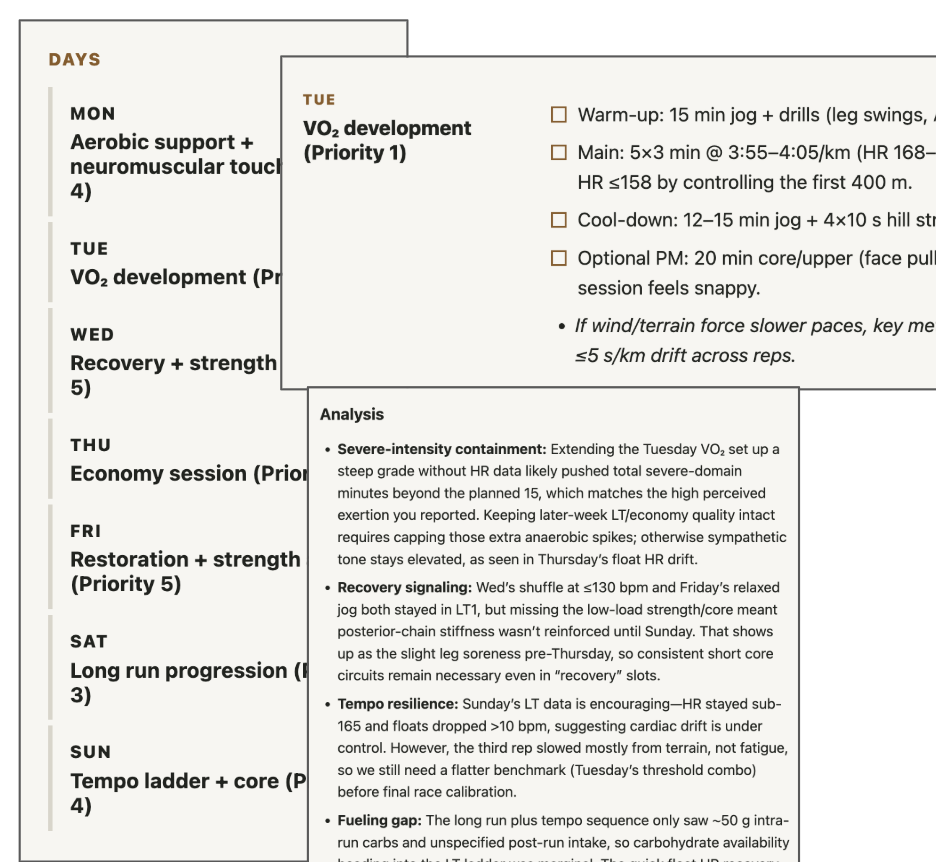

# AI Training Coach: Smash your PR 🦿

**ChatGPT has aced training physiology, but it doesn't know about you:** your goals, your skills, how well you follow advice, what kind of advice you find useful. And your training plan needs to update according to life constraints: travel, illness, fatigue, schedule pressure, or changes of plans.

This repo structure puts all this info into a GPT context window to **massively upgrade the quality and personalization of your training advice.** As you work with the coach, you can improve and tweak it to be more and more tuned to the kind of feedback that works for you.

**TL;DR for everything below: Clone repo, run Codex, start talking.**

Markdown files are the editable source of truth. Generated HTML files at the repository root are the readable training-plan surface.

<figure>
  
</figure>

## Why this beats Strava / Garmin AI coaches

The app platforms want to generate coaching advice entirely from app data. This would be cool, but it seems hopeless to me, because the subjective info you share with a coach is essential. Maybe you took it easy because you were feeling sick, or it was deathly hot, or you were running on boulders, or you went fast because you were running with a friend or accidentally coded your ride as a run.

The narrative is essential to the plan; **the coach needs to know how you're feeling in your own words.** The 2026 iterations of AI coaches are laughably bad. This is 100x better; it just works.

## Initial content

This is seeded with a time slice of my training plans from November 2025 when I was training to beat a 5k PR. I updated the goal partway in, hence some inconsistency in the docs.

The HTML files show the current quarterly and weekly plans, and the last few daily updates. The agents archives these automatically as time passes.

I like my advice grounded in physiology and evidence, hence the relatively technical nature of the AI feedback. I found GPT's default mode to be excessively inspirational and vapid, so I toned it way down in `AGENTS.md`. I discovered that I liked having a coach who was mildly annoyed when I didn't stick with the plan. Experiment and change the tone to whatever works for you.

## Getting Started

1. Edit `markdown/notes-on-user.md` with background info on your experience and your goals.
2. Create a `markdown/quarter-plan-YYYY-MM.md` with goals, constraints, and target events. Add an `app-index` block if you want the homepage to show a specific title and date range.
3. In Codex / Claude Code, ask the coach to make you a draft plan for the quarter. Negotiate / discuss until you're happy with it.
4. Ask the coach to draft your first weekly plan in `markdown/week-plan-YYYY-MM-DD.md`, providing any schedule or travel constraints that need to be considered.
5. Review, discuss, make it work to your liking. I never edit the weekly markdown files directly, I just talk to the AI like I would with a real coach and the AI updates the plan.
6. **Get outside and follow the plan!**
7. Log completed workouts in the weekly plan's report sections. It's good to put a lot of information here, because this will be preserved for later instances, while the command-line interaction won't be.
8. When appropriate, ask the coach to update `markdown/training-log.md` from completed reports.
9. Whenever you want, ask the coach to review the report and write you a daily advice file `markdown/advice-YYYY-MM-DD.md` with revisions. The content of the example advice files is varied, because it usually involves answers to questions I put on the command line, like "why u make me do strides every day."
10. Regenerate HTML with the commands above, or ask the coach to do it after any training-facing edit.

The coach will move old stuff to `markdown/archive/` in order to keep the repo clean. You can change the frequency, or anything about this, by editing `AGENTS.md`.

## Things that worked well

**Tell the coach how you felt.** My initial tendency was always to push harder than the plan called for. More is better, right? Every time I did this, the coach dialed back my next day's workout for more recovery. I'm sure this reduced my injury risk and gradually taught me to actually follow the advice.

**Ask why.** I learned a ton about training physiology through this plan. After decades of sub-optimal training I finally learned why "go as hard as you can every time you're out there" isn't the best.

**Put detailed reports in the weekly plans.** The weekly plans should have a section for you to report how you did. It's more useful to put detailed info here, such as feeling sick, injury risk, or pushed HR, vs. in the prompt, so that it's visible for future instances of the coach.

**Keep the HTML current.** The root HTML pages make the repo easier to read quickly, while Markdown remains easy for an assistant to update.

## Easy things to improve

- **Add private reference files.** For HR zones, race history, exercise catalogs, or personal notes on what to wear in which temperatures, then tell the coach in `AGENTS.md` when to consult them. The more permanent info you give the coach, the less you need to explain each time. Common knowledge is good. You can say "HR went to 165 in the last tempo" and the coach knows what this means.
- **Expand the exercise notes.** `markdown/exercise-notes.md` is useful for the coach to know whether you already know what "ankle rocks" are etc., so it explains the exercises the first time but not again.
- **Tighten the glossary.** `markdown/glossary.md` should hold your abbreviations and preferred terminology.
- **Improve the HTML UI?** Would this be better in a web app with text boxes? I'm not sure, I kind of like the back-and-forth with the coach in the Codex window. YMMV.

## Harder things to improve

- **Link to Strava/Garmin.** I started copy/pasting my splits and HR info into the Codex window. It would be nice to pull these directly from Strava or Garmin. As noted above, it still seems essential to me to pair that info with narrative context, so I don't know how helpful this would actually be. The AI isn't great at ignoring information, so if you stop for ice cream it will think you had a terrible split.
- **Link to resting HR/HRV.** They say resting HR provides advance info on recovery / illness. So it would be cool if the coach just had this info in the context without you needing to share it.
